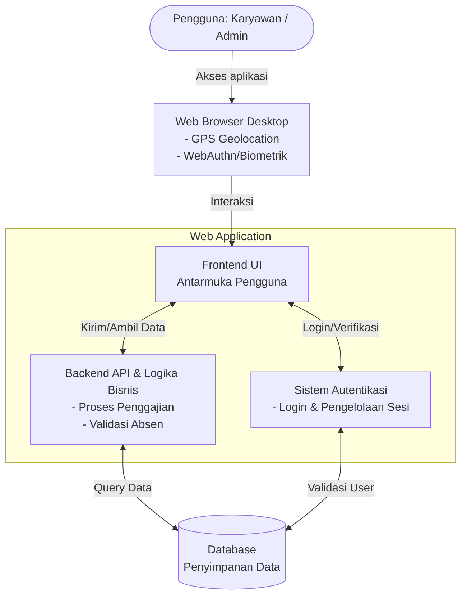
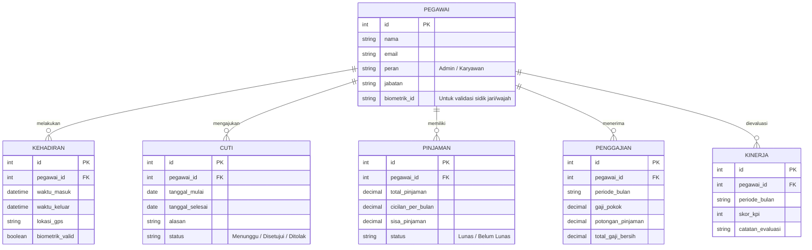

# PRD — Project Requirements Document

## 1. Overview
Aplikasi Koperasi Wira Karyawan adalah sebuah sistem berbasis web terpadu yang dirancang untuk mendigitalkan dan menyederhanakan proses administrasi HR (Sumber Daya Manusia) dan keuangan koperasi untuk skala kecil (di bawah 50 pegawai). Saat ini, pencatatan data pegawai, kehadiran, cuti, penilaian kinerja, hingga perhitungan gaji (yang dipotong pinjaman koperasi) mungkin masih dilakukan secara manual atau terpisah. 

Tujuan utama sistem ini adalah menyatukan semua proses tersebut ke dalam satu pintu (desktop web). Dengan begitu, pihak manajemen dapat memantau produktivitas dan mengelola payroll dengan cepat dan akurat, sementara karyawan dapat dengan mudah melakukan absensi harian dan memantau hak-hak mereka (seperti sisa cuti dan slip gaji).

## 2. Requirements
- **Kapasitas Pengguna:** Sistem harus dioptimalkan untuk menampung kurang dari 50 pengguna aktif.
- **Platform:** Berbasis Web Desktop (dapat diakses melalui browser komputer atau laptop).
- **Kehadiran Canggih:** Sistem absensi harus menggunakan deteksi Lokasi (GPS) dan validasi Biometrik (menggunakan teknologi pengenalan sidik jari/wajah yang ada pada perangkat via browser/WebAuthn).
- **Penggajian Terintegrasi Koperasi:** Modul payroll wajib bisa mengakomodasi dan menghitung otomatis potongan pinjaman koperasi karyawan.
- **Penilaian Berkala:** Evaluasi kinerja karyawan dinilai berdasarkan KPI (Key Performance Indicator) yang diinput setiap bulan.
- **Timeline:** Pengembangan harus dilakukan secepat mungkin (Rapid Development / MVP).
- **Integrasi Pihak Ketiga:** Tidak perlu ada integrasi dengan sistem luar; semuanya mandiri (standalone system).

## 3. Core Features
Beriku adalah fitur-fitur utama yang akan dibangun:
- **Manajemen Pegawai:** Form untuk menambah, mengubah, dan melihat profil lengkap karyawan (data diri, jabatan, divisi).
- **Dashboard Absensi (Kehadiran):** Fitur bagi karyawan untuk *Clock-in* dan *Clock-out* yang akan meminta izin akses lokasi (GPS) dan memvalidasi biometrik perangkat. Admin mendapat rekap data kehadiran.
- **Manajemen Cuti:** Karyawan dapat mengajukan cuti, dan Admin/Manajer dapat menyetujui atau menolak. Sistem otomatis melacak sisa kuota cuti.
- **Payroll & Pinjaman Koperasi:** Modul untuk menghitung gaji bulanan berdasarkan kehadiran, dikurangi potongan cicilan pinjaman koperasi jika ada. Dilengkapi fitur cetak/unduh Slip Gaji.
- **Manajemen Kinerja (Monthly KPI):** Form bagi evaluator/admin untuk memberikan nilai KPI bulanan kepada setiap karyawan guna memantau produktivitas.

## 4. User Flow
Berikut adalah gambaran langkah sederhana bagaimana pengguna berinteraksi dengan aplikasi:

**Alur Karyawan (Pegawai):**
1. **Login:** Karyawan masuk menggunakan kredensial mereka.
2. **Absensi Harian:** Saat jam masuk, karyawan menekan tombol "Absen Masuk". Browser akan mengecek lokasi (GPS) dan meminta verifikasi biometrik (misal: Windows Hello/Touch ID).
3. **Pengelolaan Harian:** Karyawan bisa membuka menu "Cuti" untuk mengajukan libur, atau menu "Slip Gaji" untuk melihat gaji bulan ini (termasuk rincian potongan pinjaman koperasi).
4. **Logout:** Karyawan keluar dari sistem.

**Alur Admin (HR/Pengurus Koperasi):**
1. **Login:** Admin masuk ke dashboard utama.
2. **Review Harian:** Admin melihat siapa saja yang hadir hari ini dan menyetujui/menolak pengajuan cuti yang masuk.
3. **Evaluasi Bulanan:** Setiap akhir bulan, Admin masuk ke menu "Manajemen Kinerja" untuk menginput nilai KPI bulanan karyawan.
4. **Proses Payroll:** Admin masuk ke menu "Payroll", sistem akan otomatis menghitung gaji berdasarkan absen, cuti, dan memotong cicilan pinjaman koperasi. Admin mempublikasikan slip gaji.

## 5. Architecture
Karena aplikasi ini dibuat untuk penggunaan skala kecil (<50 orang) dan membutuhkan waktu pengembangan yang cepat, arsitektur yang digunakan adalah sistem Monolitik modern. Web app akan menangani antarmuka pengguna sekaligus logika bisnis dan akses ke database secara langsung.

## 6. Database Schema
Sistem akan menggunakan beberapa tabel utama untuk menyimpan data. Berikut adalah rancangannya:

- **Pegawai:** Menyimpan informasi dasar karyawan (Nama, Email, Jabatan).
- **Kehadiran:** Menyimpan catatan waktu masuk/keluar harian, titik kordinat GPS, dan status biometrik modern.
- **Cuti:** Menyimpan riwayat pengajuan cuti, tanggal, alasan, dan status persetujuan.
- **Pinjaman:** Menyimpan data pinjaman koperasi, total pinjaman, dan cicilan per bulan.
- **Penggajian:** Menyimpan riwayat slip gaji bulanan, rincian tunjangan, dan nominal potongan pinjaman.
- **Kinerja:** Menyimpan nilai KPI bulanan dan catatan evaluasi karyawan.

## 7. Tech Stack
Untuk memenuhi kebutuhan *timeline* yang harus dikerjakan secepatnya (*rapid development*) dengan jumlah pengguna yang sedikit (<50 pengguna), berikut adalah rekomendasi teknologi terbaik yang efisien namun tetap bertenaga:

- **Frontend & Backend (Full-stack Framework):** `Next.js` — Memungkinkan pembuatan antarmuka dan API (logika server) dalam satu proyek yang sama, sangat mempercepat waktu rilis.
- **UI & Styling:** `Tailwind CSS` & `shadcn/ui` — Menyediakan desain antarmuka yang modern, responsif, siap pakai, dan rapi secara instan tanpa perlu mendesain dari nol.
- **Database Relasional:** `SQLite` — Sangat ringan, tidak memerlukan setup server database yang rumit, dan lebih dari cukup untuk menangani data puluhan pengguna dengan sangat cepat.
- **Database ORM (Alat Komunikasi Database):** `Drizzle ORM` — Memudahkan developer menulis kode untuk berinteraksi dengan database secara aman.
- **Authentication (Sistem Login):** `Better Auth` — Solusi login modern yang aman dan mudah diintegrasikan dalam ekosistem Next.js, mendukung fitur canggih termasuk infrastruktur ke arah WebAuthn (biometrik browser).